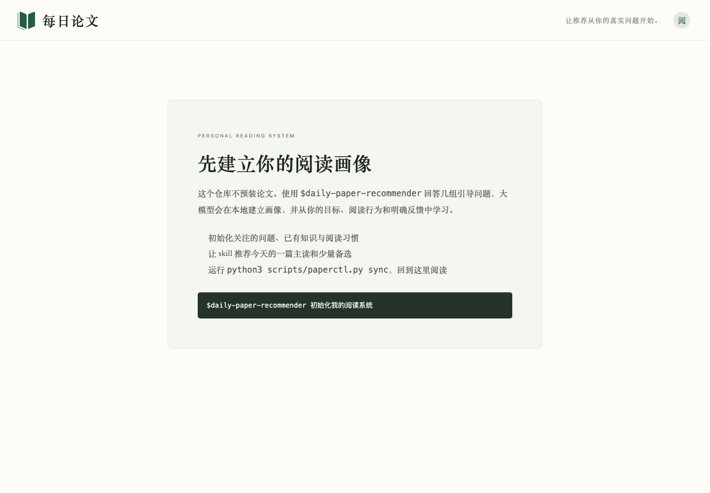

<p align="center">
  
</p>

<h1 align="center">Paper Otter</h1>

<p align="center">个性化论文阅读推荐框架</p>

一个由大模型驱动、数据保存在本地的论文阅读系统。它先让读者从一组具体论文中选出会点开的内容，再结合每天的打开、有效阅读时间、进度、点赞、收藏和明确拒绝，逐步形成画像，推荐一篇主读与少量备选。

仓库只提供框架、网站和 skills，**不包含论文正文、用户画像或论文原图**。



## 它怎样工作

```text
具体论文点选 → 临时读者画像 → 候选论文检索 → LLM 可解释排序
   ↑                                           ↓
文字反馈 ← 阅读行为与显式反馈 ← 今日主读与中文精读稿
```

- **大模型负责语义判断**：理解真实工作目标、比较候选、解释推荐，并在需要时生成中文精读稿。
- **本地数据负责长期记忆**：画像、候选审计、每日推荐、文章和行为记录位于 `.paper-daily/`，默认不进入 Git。
- **网站负责阅读体验**：展示本地生成的内容，并记录有效阅读时长、浏览进度和显式反馈。
- **排序过程可审计**：保留各维判断与淘汰原因，不用一个不可解释的总分代替推荐理由。

## 开始使用

需要 Node.js 22.13+、Python 3.9+ 和 Codex。

```sh
npm ci
npm run dev
```

然后在仓库中调用：

```text
$otter init
```

skill 不会假设新仓库里已经有你的阅读数据，也不会先让你概括自己的兴趣。它先让你点选一两个具体领域，再展示 6–8 篇真实论文，让你选出现在会打开的几篇；必要时再做一次具体的二选一。首轮画像可以不完整，其余偏好从后续阅读中逐步学习。之后可以说：

```text
$otter recommend
$otter write <paper-id 或论文链接>
$otter research <问题>
```

`recommend` 只在私有状态中生成推荐卡，不会把空文章发布到网站；`write` 为一篇论文生成精读稿；`research` 围绕一个问题检索多篇论文和一手材料，建立证据矩阵后写成专题调研。后两者都会经过独立逻辑审查和首次阅读检查。只有完整成品通过门禁后，skill 才运行 `npm run content:sync`。网站从 `public/local/catalog.json` 读取成品，私有状态和发布副本都已忽略。

## 仓库结构

```text
app/ components/                阅读网站与反馈界面
db/ drizzle/                    用户行为数据与迁移
scripts/paperctl.py              初始化、校验、事件记录和网站同步
skills/otter/                    初始化、推荐、精读与专题调研
skills/zh-write-skills/   中文技术内容写作子流程
lib/                             公共类型与反馈校验
.github/                         CI、Dependabot 和 Issue 模板
```

数据格式、推荐原则和调研方法分别见 [data-model.md](skills/otter/references/data-model.md)、[recommendation.md](skills/otter/references/recommendation.md) 与 [research.md](skills/otter/references/research.md)。

## 反馈如何影响推荐

| 信号 | 默认解释 |
|---|---|
| 不感兴趣及原因 | 强负反馈，区分主题、深度和时机 |
| 点赞、收藏、读完 | 强正反馈 |
| 短时打开 | 弱负反馈，需要结合其他信号 |
| 曝光后未打开 | 弱负反馈，连续出现才暂停同类推荐 |
| 没有点赞 | 单独不判负；与低时长或低进度共同出现时降低权重 |
| 用户新表达的目标 | 覆盖历史推断 |

默认保留约 20% 的邻近探索，防止推荐越来越窄。

## 验证

本地服务运行时执行：

```sh
npm run lint
npm run framework:check
npm run build
npm test
npm audit --omit=dev
```

GitHub Actions 在 push 和 pull request 上执行同一套检查。生产依赖当前无已知漏洞。

## 发布与贡献

发布步骤见 [docs/PUBLISHING.md](docs/PUBLISHING.md)，贡献约定见 [CONTRIBUTING.md](CONTRIBUTING.md)，安全问题请按 [SECURITY.md](SECURITY.md) 私下报告。仓库尚未选择开源许可证；公开发布前需要由维护者确定。
